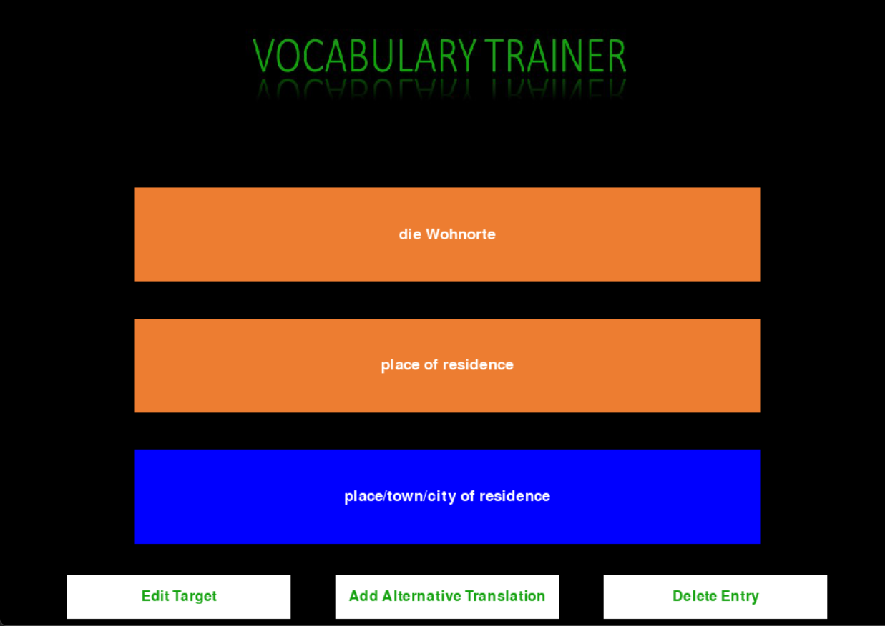
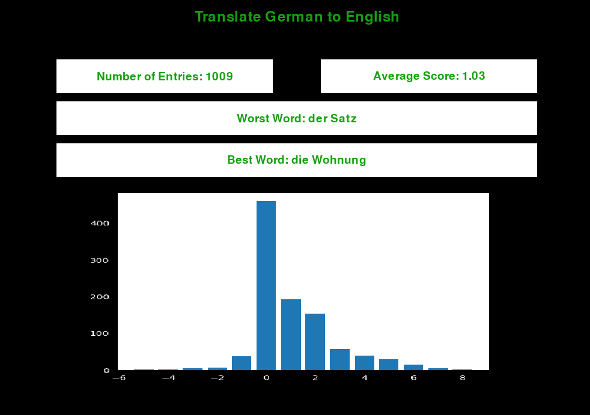
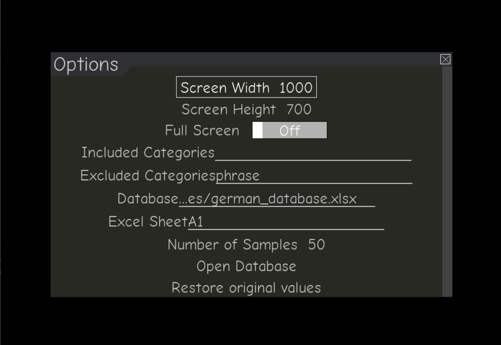

# Vocabulary Trainer
 In the process of learning a new language, I couldn't find a free tool for testing what words I memorized. I also looked through multiple open-source python projects on github ([example](https://github.com/cocreators-ee/vocabulary-trainer/blob/main/data_processing/translate.py)), although they were great, they didn't do what I wanted. So I built this application. 
 ## Offered Features
 The tool has the following feature:
 ### Practicing Vocabulary
 - The tool has a GUI for reciting vocabulary from an Excel database.
 - The tool detects the languages (language you know and language you want to learn) from the database.
 - You can edit, delete, or add alternative translations when working with the app.
   <p align="center">
    
   </p>
 ### Sampling Questions
 - You can do exercises on a small sample from the database to memorize words one batch at a time. 
 - The tool focuses on questions you're answering wrong.
 
### Scores
 - The tool stores scores over multiple sessions (scores for an exercise are stored as json files with ID linking to the database)
 - The tool provides a visualization for the score in a particular exercise.
   <p align="center">
    
   </p>
 ### Options
 - An options menu that helps customize some parameters in the application.
   <p align="center">
    
   </p>


 ## Installation and Usage
 Installing and using the app is easy (for someone comfortable with python at least):
 - Clone the repository on your device.
 - [Optional] Create a conda environment with python 3.10:
```
   conda create --name vocab_tool python=3.10
   conda activate vocab_tool
 ```
 - Install the python packages necessary:
```
  pip install -r requirments.txt
``` 
 To use the tool, just activate your environment (if on conda), and run the script in main.py
```
  python main.py
```
 By default, the tool will select the database in "resources/german_database.xlsx" and the Excel sheet "A1". You can add word by updating the selected database, or change the selected Excel path to a custom file (make sure your file have the same columns as the one in "german_database.xlsx").
 ## Possible Additions
 - Several exercises for nouns (female-to-male, singular-to-plural)
 - A customizable sampling strategy for choosing the questions.
 - Verb conjugations (this have some challenges, mainly seeing a good way for collecting and storing different verbs with their conjugation)
 - A better design for the app, instead of the bland design used as of now.
 
 ## Collaboration Plea
 For me, the tool "as-is" is the best way to recite and memorize vocabulary. That said, the more features added to the tool the better. So if anybody wants to help implement an open feature it would be appreciated. Also, in case you used the tool with a custom database consider sharing it to benefit others.
 
 ## Acknowledgements
The tool was inspired by [LearnDW](https://learngerman.dw.com/en/overview) which is a website for teaching german language. The database I collected is from there. They also have a tool to help you memorize vocabulary (it's helpful, but still neither tracks your scores nor focuses on stuff you don't know).
Also, I haven't done a GUI interface before, so I got started by learning from the code in ["codecravings/Speed-Typing-Test-Python"](https://github.com/codecravings/Speed-Typing-Test-Python).

## Documentation tasks
- Add documentation for the tool structure.
- Add instructions for building the database
